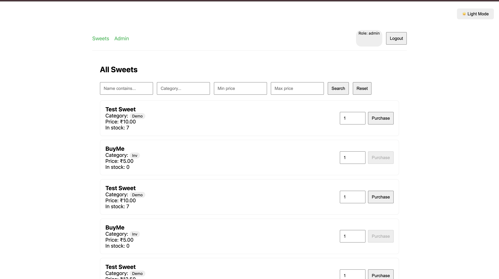
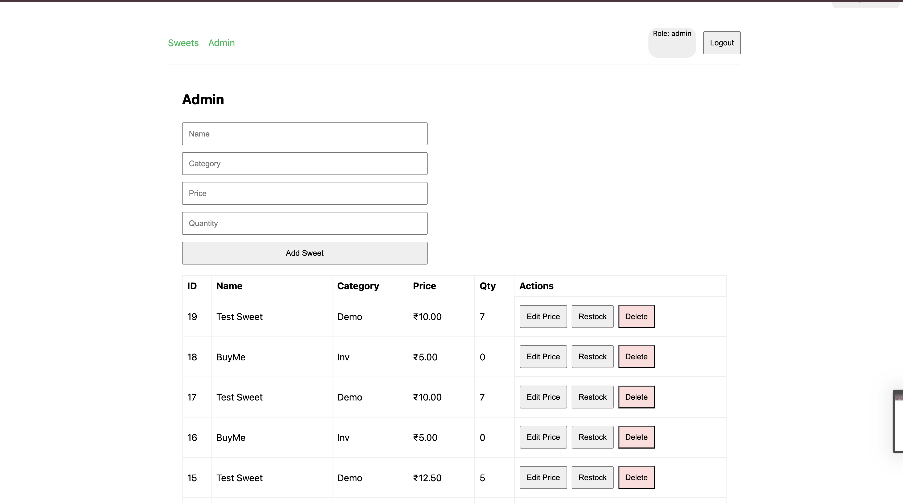
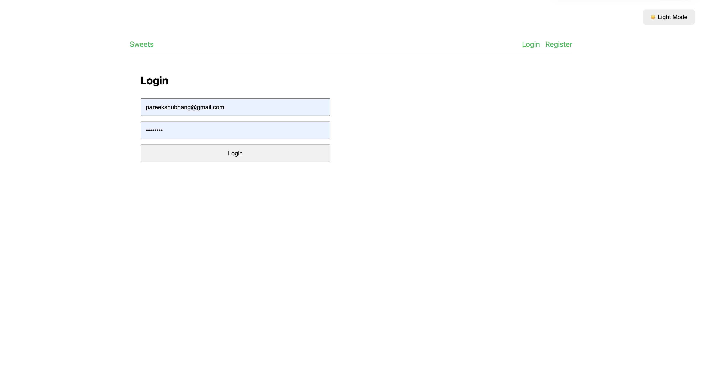

# Sweet Shop Management System

Full-stack app with **FastAPI** backend and **React + Vite** frontend.

## Tech
- **Backend:** FastAPI, SQLAlchemy, SQLite (file DB), JWT (PyJWT), passlib (bcrypt), pytest
- **Frontend:** React (Vite), Axios, React Router
- **Auth:** Register/Login with roles (`user`, `admin`), JWT bearer
- **Protected API:** sweets CRUD + search, purchase/restock (admin-only where required)

## Run locally

### 1) Backend
```bash
cd backend
cp .env.example .env   # (edit if needed)
python -m venv .venv
source .venv/bin/activate   # Windows: .venv\Scripts\activate
pip install -r requirements.txt
uvicorn app.main:app --reload

# 🍬 Sweet Shop Management System

A full-stack Sweet Shop Management System built with **FastAPI** (backend) and **React + Vite** (frontend). Designed using **TDD principles**, secured via **JWT-based Auth**, and supports both user and admin roles.

---

## 🛠 Tech Stack

### 🔙 Backend
- **FastAPI**: API framework
- **SQLAlchemy + SQLite**: ORM and DB (file-based)
- **JWT**: Auth via `PyJWT`
- **bcrypt**: Password hashing via `passlib`
- **pytest**: Unit testing

### 🌐 Frontend
- **React + Vite**: SPA frontend
- **Axios**: API requests
- **React Router DOM**: Routing
- **Tailwind CSS**: Styling and responsiveness

---

## 🚀 Features

### 👤 Authentication
- Register / Login
- Roles: `user`, `admin`
- Token-based auth (JWT)

### 🍭 Sweets API (Protected)
- `GET /api/sweets`: Get all sweets
- `GET /api/sweets/search?name=...&category=...&minPrice=...&maxPrice=...`: Filter sweets
- `POST /api/sweets`: Add sweet (Admin)
- `PUT /api/sweets/:id`: Edit sweet (Admin)
- `DELETE /api/sweets/:id`: Delete sweet (Admin)

### 📦 Inventory
- `POST /api/sweets/:id/purchase`: Purchase a sweet (quantity -1)
- `POST /api/sweets/:id/restock`: Restock a sweet (Admin only)

---

## 💻 How to Run Locally

### 1️⃣ Backend

```bash
# Navigate to backend folder
cd backend

# Setup virtual environment
python -m venv .venv
source .venv/bin/activate      # On Windows: .venv\Scripts\activate

# Install dependencies
pip install -r requirements.txt

# Copy env file
cp .env.example .env

# Run the server
uvicorn app.main:app --reload
```

### 2️⃣ Frontend

```bash
# Navigate to frontend folder
cd ../frontend

# Install dependencies
npm install

# Start the app
npm run dev
```

App should be running at:  
Frontend → `http://localhost:5173`  
Backend → `http://localhost:8000`

---

## 🔒 Admin Credentials (for testing)

```bash
email: pareekshubhang@gmail.com
password: 12345678
```

---

## ✅ Tests (TDD)

Run backend unit tests via:

```bash
cd backend
pytest
```

### 🧪 Test Report

The backend was tested using `pytest` with full coverage of core modules.

#### ✅ Summary

- `tests/test_auth.py` – Passed
- `tests/test_inventory.py` – Passed
- `tests/test_sweets.py` – Passed

#### 🔧 Run Output
```bash
collected 4 items

tests/test_auth.py .          [ 25%]
tests/test_inventory.py .     [ 50%]
tests/test_sweets.py ..       [100%]

=== 4 passed, 2 warnings in 1.50s ===
```

> Warnings were non-breaking: related to deprecation in `pydantic` and `multipart`.

---

## 🖼 Screenshots

| Home View | Admin Panel | Login |
|-----------|-------------|-------------|
|  |  | |

## 🤖 My AI Usage

This project extensively leveraged **AI tools** throughout the development process. Here's a breakdown of how they contributed:

### 🧰 AI Tools Used

- **ChatGPT (GPT-4 & GPT-4o)**: 
  - Helped brainstorm full-stack app ideas and backend architecture.
  - Generated starter code for FastAPI endpoints, models, and services.
  - Debugged errors and optimized Python + React code.
  - Explained unfamiliar library usage like SQLAlchemy, JWT, etc.
  - Drafted test cases and helped with TDD structure.

- **GitHub Copilot**:
  - Autocompleted boilerplate functions and React components.
  - Suggested hook implementations and API calls in Axios.
  - Accelerated repetitive code writing (e.g., forms, props, fetchers).

### 💡 Example Usage

- Designed the structure of the `search` endpoint with query params.
- Generated dynamic filtering logic and restock logic for admin.
- Created and refined unit test skeletons using `pytest`.
- Suggested responsive Tailwind layout tweaks and theming logic.
- Provided CAML query logic for SharePoint (external reference logic).
- Helped format and refactor the README and markdown docs.

### 🎯 Reflections

AI was a **superpower**, especially when working solo. It drastically improved my speed and helped me maintain focus by offloading syntax lookups and error debugging.

However:
- I always **reviewed and customized** suggestions for context.
- I handled **all architectural decisions** and **core logic** myself.
- AI accelerated delivery — it didn’t replace the need for understanding.

This project reflects a **hybrid human-AI workflow** with careful judgment and iteration.

### ✅ Co-author Attribution

Some commits include:

```
Co-authored-by: ChatGPT
```

---

## 📦 Folder Structure

```
sweet-shop/
├── backend/
│   ├── app/
│   ├── tests/
│   └── ...
├── frontend/
│   ├── src/
│   └── ...
├── README.md
└── screenshots/
```

---

## 🌐 Deployment

(Optional)

- Frontend: Vercel / Netlify
- Backend: Render / Railway
- DB: MongoDB Atlas or Railway SQLite

---

## 📬 Contact

Created by **Shubhang Pareek**  
Feel free to reach out via [LinkedIn](https://www.linkedin.com/in/shubhang-pareek-7631b0222)

---
